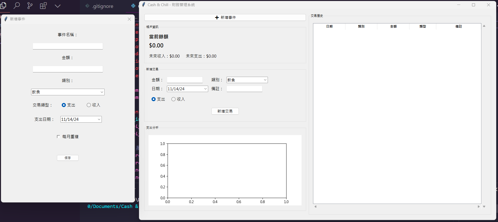
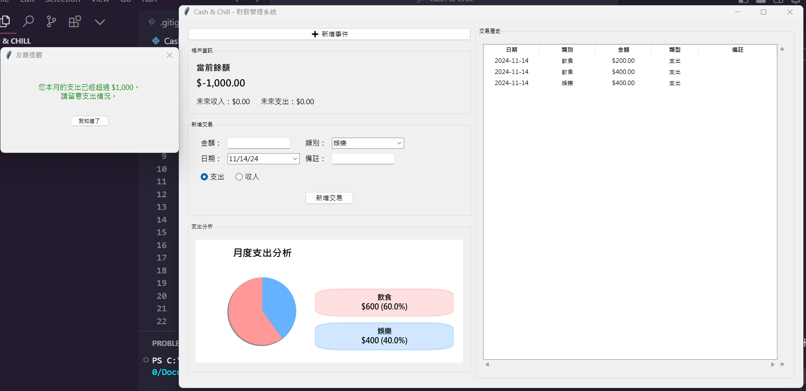

# 💰 Cash & Chill 財務管理系統

  

這是一個使用 Python 和 Tkinter 開發的財務管理系統，幫助用戶追蹤和管理個人財務。透過直觀的介面和強大的功能，讓您輕鬆掌握財務狀況！

## ✨ 功能特點

- 📊 即時收支統計與圖表分析
- 💹 智能預算警告系統
- 📅 定期交易自動排程
- 📝 詳細的交易記錄管理
- 🎨 美觀的圖形化介面

  

## 🚀 安裝指南

1. 確保您已安裝 Python 3.7+
2. 安裝所需套件：